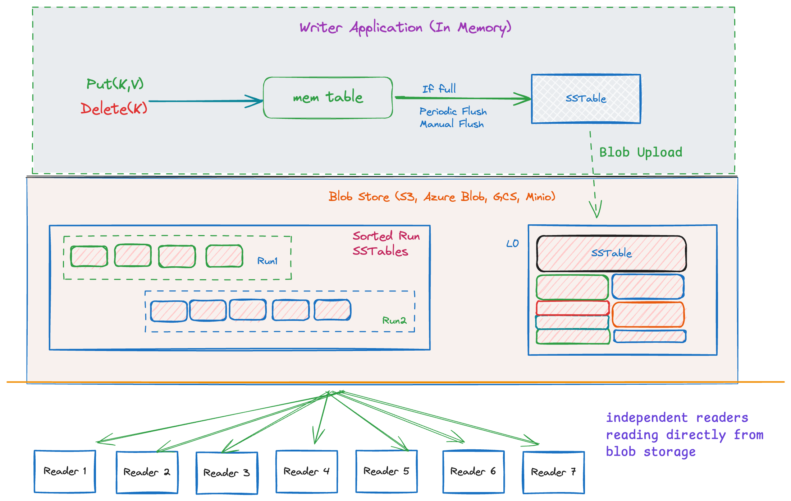

## IsleDB


**IsleDB is an embedded key-value engine designed for object storage. It borrows ideas from LSM-trees but
rethinks them for object storage.**

Writes go to an in-memory memtable first, then get flushed to SST files periodically. This batching
matters—instead of hitting object storage on every `put()`, you amortize costs across many writes. Large
values get stored separately as blobs so the SSTs stay small.

The SST files themselves live in object storage (S3, GCS, Azure, MinIO, etc). Your capacity and
durability scale with the bucket, not your local disk.

Readers attach to the same bucket/prefix, stream SSTs and blobs on demand, and use local caches to
minimize re-downloads—so read capacity scales horizontally without replicas.

### Features
1. Data lives on object storage (S3, GCS, Azure Blob, MinIO). 
2. Bottomless capacity. 
3. Object Store durability. 
4. Readers scale horizontally-no replicas, no connection limits.
5. Three compaction modes (Merge, FIFO, Time-Window)



### Getting Started

#### Create a Blob Store Connection(s3, azure, gcp) and DB Instance 
```go
ctx := context.Background()

store, err := blobstore.NewFile(ctx, "./data", "db1")
if err != nil {
	log.Fatal(err)
}
defer store.Close()

db, err := isledb.OpenDB(ctx, store, isledb.DBOptions{})
if err != nil {
	log.Fatal(err)
}
defer db.Close()
```

Cloud buckets (S3, GCS, Azure) use Go Cloud bucket URLs:
```go
ctx := context.Background()

// S3
store, err := blobstore.Open(ctx, "s3://my-bucket?region=us-east-1", "db1")
if err != nil {
	log.Fatal(err)
}

// GCS
store, err = blobstore.Open(ctx, "gs://my-bucket", "db1")
if err != nil {
	log.Fatal(err)
}

// Azure Blob
store, err = blobstore.Open(ctx, "azblob://my-container", "db1")
if err != nil {
	log.Fatal(err)
}
defer store.Close()

db, err := isledb.OpenDB(ctx, store, isledb.DBOptions{})
if err != nil {
	log.Fatal(err)
}
defer db.Close()
```

#### Writer (single writer per bucket/prefix)

IsleDB uses a **write-ahead memtable** architecture where writes are first buffered in memory before being flushed to 
persistent SST files. Large values are stored separately in blob storage to keep SSTs compact.

```go
opts := isledb.DefaultWriterOptions()
writer, err := db.OpenWriter(ctx, opts)
if err != nil {
	log.Fatal(err)
}
defer writer.Close()

batch := []struct {
	key   string
	value string
}{
	{key: "hello", value: "world"},
	{key: "foo", value: "bar"},
}
for _, kv := range batch {
	if err := writer.Put([]byte(kv.key), []byte(kv.value)); err != nil {
		log.Fatal(err)
	}
}
if err := writer.Flush(ctx); err != nil {
	log.Fatal(err)
}
```

#### Reader
Readers open against the same bucket/prefix and fetch SSTs and blobs on demand. Configure local caches
to reduce repeated downloads, and scale readers horizontally as needed.

```go
reader, err := isledb.OpenReader(ctx, store, isledb.ReaderOpenOptions{
	CacheDir: "./cache",
})
if err != nil {
	log.Fatal(err)
}
defer reader.Close()

value, ok, err := reader.Get(ctx, []byte("hello"))
if err != nil {
	log.Fatal(err)
}
if ok {
	log.Printf("value=%s", value)
}
```

#### Tailing Reader

Continuously streams new KV writes by polling for new SSTs and emitting entries in order.
Good for event/log style consumption when you want a live feed over object storage.

```go
tr, err := isledb.OpenTailingReader(ctx, store, isledb.TailingReaderOpenOptions{
	RefreshInterval: time.Second,
	ReaderOptions: isledb.ReaderOpenOptions{
		CacheDir: "./cache",
	},
})
if err != nil {
	log.Fatal(err)
}
defer tr.Close()

if err := tr.Start(); err != nil {
	log.Fatal(err)
}
err = tr.Tail(ctx, isledb.TailOptions{
	PollInterval: time.Second,
}, func(kv isledb.KV) error {
	log.Printf("%s=%s", kv.Key, kv.Value)
	return nil
})
if err != nil {
	log.Fatal(err)
}
```

#### Compaction

IsleDB ships multiple compaction paths so you can pick what matches your workload.

#### SSTable Compactor (merge)

Merges L0 SSTs into sorted runs and compacts consecutive sorted runs as needed to reduce read amplification.
Use this for normal LSM maintenance.

```go
compactor, err := db.OpenCompactor(ctx, isledb.DefaultCompactorOptions())
if err != nil {
	log.Fatal(err)
}
defer compactor.Close()

compactor.Start()
```

#### Retention Compactor (by age / FIFO)

Deletes oldest SSTs once they are older than `RetentionPeriod`, while keeping at least `RetentionCount` newest SSTs.

```go
retention, err := db.OpenRetentionCompactor(ctx, isledb.RetentionCompactorOptions{
	Mode:            isledb.CompactByAge,
	RetentionPeriod: 7 * 24 * time.Hour,
	RetentionCount:  10,
})
if err != nil {
	log.Fatal(err)
}
defer retention.Close()

retention.Start()
```

#### Retention Compactor (by time window)

Groups SSTs into time buckets (`SegmentDuration`) and deletes whole segments that end before `RetentionPeriod`.
It keeps at least `RetentionCount / 10` segments (minimum 1).

`RetentionPeriod` controls how far back data is eligible for deletion. `SegmentDuration` controls the size
of each bucket (for example, 1 day buckets with a 7 day retention keeps only the most recent 7 daily segments).

```go
retention, err := db.OpenRetentionCompactor(ctx, isledb.RetentionCompactorOptions{
	Mode:            isledb.CompactByTimeWindow,
	RetentionPeriod: 7 * 24 * time.Hour,
	SegmentDuration: 24 * time.Hour,
	RetentionCount:  10,
})
if err != nil {
	log.Fatal(err)
}
defer retention.Close()

retention.Start()
```

### Examples
- `examples/kvfile`: local file-backed KV usage with writer/reader/tailer.
- `examples/walazblob`: WAL-style event stream on Azurite/Azure Blob (tailing events).
