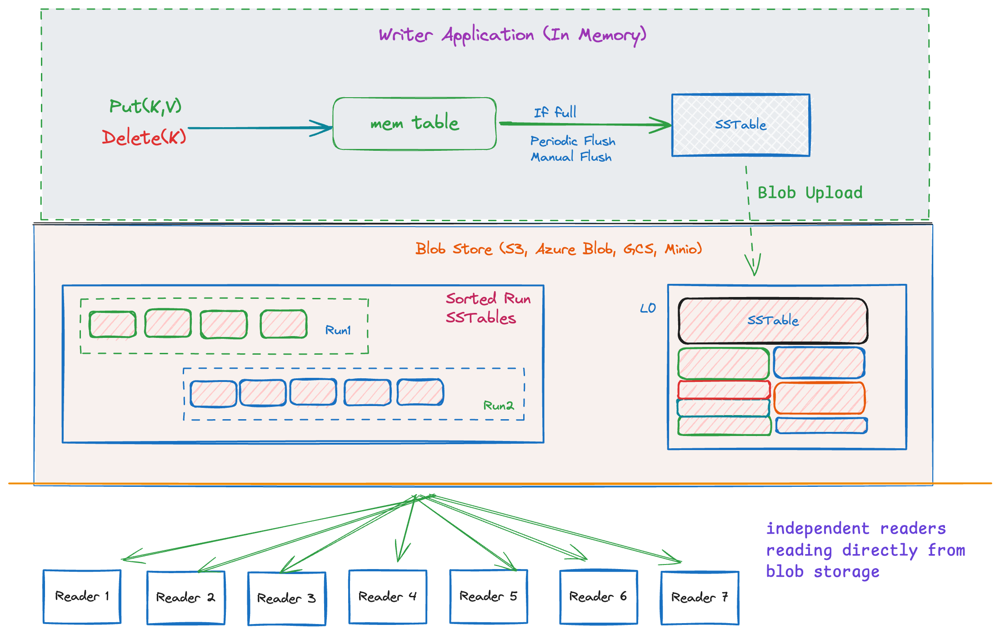

## IsleDB


[](https://github.com/ankur-anand/isledb/actions/workflows/go.yml)
[](https://coveralls.io/github/ankur-anand/isledb?branch=main)
[](https://pkg.go.dev/github.com/ankur-anand/isledb)
[](LICENSE)

**IsleDB is an embedded key-value engine designed for object storage. It borrows ideas from LSM-trees but
rethinks them for object storage.**

Writes go to an in-memory memtable first, then get flushed to SST files periodically. This batching
matters—instead of hitting object storage on every `put()`, you amortize costs across many writes. Large
values get stored separately as blobs so the SSTs stay small.

The SST files themselves live in object storage (S3, GCS, Azure, MinIO, etc). Your capacity and
durability scale with the bucket, not your local disk.

Readers attach to the same bucket/prefix, stream SSTs and blobs on demand, and use local caches to
minimize re-downloads—so read capacity scales horizontally without replicas.

### Features
1. Data lives on object storage (S3, GCS, Azure Blob, MinIO). 
2. Bottomless capacity. 
3. Object Store durability. 
4. Readers scale horizontally-no replicas, no connection limits.
5. Three compaction modes (Merge, FIFO, Time-Window)
6. Separate Writer and Compaction Process
7. Pluggable Manifest store

### Architecture

One IsleDB database maps to one object-store prefix. Under that prefix, IsleDB stores:

- hot manifest metadata for discovery and fencing
- immutable SST files for committed data
- optional blob objects for large values
- GC coordination state for asynchronous cleanup

The important boundary is visibility: a write is not visible to readers just because it exists in writer memory. It becomes visible when the writer publishes manifest state that references the new SST files.

For the exact per-file object-store schema and JSON examples, see [Object Store Schema](docs/object-store-schema.md).



#### Core Components

| Component | Role |
| --- | --- |
| `blobstore.Store` | Resolves object paths under one prefix and reads/writes objects on S3, GCS, Azure Blob, MinIO, or local file-backed storage. |
| `DB` | Shared control plane for a single prefix. Opens writers and maintenance processes against the same manifest state. |
| `Writer` | Buffers writes in memory, spills them into immutable SSTs, uploads those SSTs, and publishes manifest changes. Large values can be written as separate blob objects. |
| `Manifest store` | Tracks the durable visible state of the database. `manifest/CURRENT` is the hot pointer; snapshots, bounded active entries, and immutable commit pages define the full topology. |
| `Reader` | Refreshes manifest state, fetches SSTs and blobs on demand, and uses local caches to avoid repeated downloads. |
| `Snapshot` | Pins one loaded reader view so multiple reads see a consistent manifest version. |
| `Compactor` | Rewrites L0 SSTs and sorted runs into a more efficient layout, then publishes the new topology through the manifest. |
| `RetentionCompactor` | Applies FIFO or time-window retention, advances low-watermark metadata, and coordinates physical deletion of obsolete SSTs. |
| `GC mark storage` | Stores pending-delete marks and replay checkpoints so cleanup can proceed safely across restarts. |
| `SST files` | Immutable data files stored in object storage. Readers open these directly; compactors create replacement SSTs rather than modifying them in place. |
| `Blob storage` | Optional external-value storage. Values above the configured threshold are written to `blobs/` and referenced from SST entries. |

#### Object Layout Under One Prefix

For a database opened with prefix `demo/p000`, the object-store layout can include:

```text
demo/p000/
  manifest/
    CURRENT
    snapshots/
      <id>.manifest
    pages/
      l00/
        <page-id>.json
      l01/
        <page-id>.json
    gc/
      pending-sst/
        pending.json
      checkpoint.json
  sstable/
    <bucket>/
      <sst-id>
  changes/                 # optional experimental change-batch objects
    <bucket>/
      <change-batch-id>
  blobs/
    <prefix>/
      <blob-id>.blob
```

What each object family does:

| Path | Format | Written by | Read by | Purpose |
| --- | --- | --- | --- | --- |
| `manifest/CURRENT` | JSON | writer, compactor, retention compactor | reader, maintenance processes | Hot control record and visibility boundary. Holds fences, replay bounds, bounded active entries, and immutable page refs. |
| `manifest/snapshots/<id>.manifest` | JSON | snapshot publication path via `manifest.Store.WriteSnapshot` | reader, compactor, retention compactor | Optional full manifest snapshot describing the complete visible SST topology at a point in time. |
| `manifest/pages/lNN/<page-id>.json` | JSON | writer, compactor, retention compactor | reader, compactor, retention compactor | Immutable committed manifest pages. Level 0 pages hold entries; higher levels hold page refs. Only pages referenced by `CURRENT` are visible. |
| `manifest/gc/pending-sst/pending.json` | JSON | compactor, retention compactor | compactor, retention compactor | Tracks SSTs that are no longer referenced and are waiting for physical deletion. |
| `manifest/gc/checkpoint.json` | JSON | retention compactor | retention compactor | Stores GC replay progress over manifest history. |
| `sstable/<bucket>/<sst-id>` | Binary | writer, compactor | reader, compactor, retention compactor | Immutable SST bytes containing committed key/value data. The bucket is deterministically derived from the SST ID. |
| `changes/<bucket>/<change-batch-id>` | Binary | writer when experimental change feed is enabled | maintenance processes | Optional committed mutation batch emitted with a memtable flush. This is not part of the stable core KV read path. |
| `blobs/<prefix>/<blob-id>.blob` | Binary | writer | reader | External value objects used when large values are stored out-of-line. |

#### Write, Read, and Cleanup Lifecycle

1. `Writer.Put` buffers keys in the active memtable. If a value crosses the blob threshold, the value bytes are uploaded to `blobs/` first and the memtable stores a blob reference.
2. `Writer.Flush` seals one or more memtables into immutable SSTs and uploads those files to bucketed `sstable/` paths.
3. After the SST objects exist, the writer commits manifest state by CAS-updating `manifest/CURRENT`. Small recent entries stay in `CURRENT.active_entries`; older entries rotate into immutable `manifest/pages/` objects. This is the visibility boundary for readers.
4. `Reader.Refresh` reloads `manifest/CURRENT` plus any needed snapshot/page files. Point reads, scans, and iterators then read newly visible SSTs and blobs on demand.
5. `Reader.Snapshot` pins the current loaded state so a caller can run multiple reads against one consistent view while the parent reader refreshes independently.
6. `Compactor` rewrites SST layout for lower read amplification and publishes the replacement topology through new manifest entries.
7. `RetentionCompactor` removes old SSTs from visible manifest state, records pending-delete marks in `manifest/gc/*`, and later deletes obsolete SST objects.

### Use Cases

One library, many workloads. The same storage model can power key-value APIs, state materialization, snapshot reads, and object-storage-first data pipelines.

- **Object-store KV** — Serve Get/Scan workloads with object-store durability. *Common alternative: managed key-value services.*
- **Event Store** — Append ordered events and build projections from replay. *Common alternative: dedicated event databases.*
- **CDC Pipeline Buffer** — Stage changes in object storage before indexing and analytics.

### When not to use IsleDB

Pick the right tool for the workload. IsleDB is strongest in object-storage-first, append-heavy systems.

#### Strong fit for IsleDB

- Append-heavy workloads (logs, events, CDC)
- Large datasets where 1-10 second read latency is acceptable
- Multi-reader / fan-out architectures
- Cost-sensitive storage at scale
- Serverless / ephemeral compute

#### Better choices elsewhere

- **Sub-10ms latency SLAs** → Use low-latency serving data stores
- **High-frequency point updates to same keys** → Use update-optimized transactional stores
- **Complex queries / joins / transactions** → Use relational transactional databases
- **Small hot datasets (<1GB)** → Use in-memory stores

### Full API Reference

[API-Reference](api.md)

### Getting Started

#### Create a Blob Store Connection(s3, azure, gcp) and DB Instance 
```go
ctx := context.Background()

dir, _ := filepath.Abs("./data")
store, err := blobstore.Open(ctx, "file://"+dir, "db1")
if err != nil {
	log.Fatal(err)
}
defer store.Close()

db, err := isledb.OpenDB(ctx, store, isledb.DBOptions{})
if err != nil {
	log.Fatal(err)
}
defer db.Close()
```

Cloud buckets (S3, GCS, Azure) use Go Cloud bucket URLs:
```go
ctx := context.Background()

// S3
store, err := blobstore.Open(ctx, "s3://my-bucket?region=us-east-1", "db1")
if err != nil {
	log.Fatal(err)
}

// GCS
store, err = blobstore.Open(ctx, "gs://my-bucket", "db1")
if err != nil {
	log.Fatal(err)
}

// Azure Blob
store, err = blobstore.Open(ctx, "azblob://my-container", "db1")
if err != nil {
	log.Fatal(err)
}
defer store.Close()

db, err := isledb.OpenDB(ctx, store, isledb.DBOptions{})
if err != nil {
	log.Fatal(err)
}
defer db.Close()
```

#### Writer (single writer per bucket/prefix)

IsleDB uses a **write-ahead memtable** architecture where writes are first buffered in memory before being flushed to 
persistent SST files. Large values are stored separately in blob storage to keep SSTs compact.

`Put` and `Delete` buffer mutations in the active memtable. A mutation becomes durable and visible to newly refreshed
readers after `Flush`, a background flush, or `Close` commits the SST metadata to the manifest. `Writer` uses internal
locks to coordinate with background flushing, but concurrent public calls do not have documented ordering or Close/Flush
semantics. Serialize calls for one writer.

```go
opts := isledb.DefaultWriterOptions()
writer, err := db.OpenWriter(ctx, opts)
if err != nil {
	log.Fatal(err)
}
defer writer.Close(ctx)

batch := []struct {
	key   string
	value string
}{
	{key: "hello", value: "world"},
	{key: "foo", value: "bar"},
}
for _, kv := range batch {
	if err := writer.Put(ctx, []byte(kv.key), []byte(kv.value)); err != nil {
		log.Fatal(err)
	}
}
if err := writer.Flush(ctx); err != nil {
	log.Fatal(err)
}
```

Writer behavior:

- `Flush` is the synchronous publish boundary. It writes pending memtables as SSTs and commits the manifest entries.
- `Close` stops background flushing and flushes pending writes before returning.
- `Flush.Interval` enables background flush. Background errors are reported through `OnFlushError`; explicit `Flush` and `Close` return errors directly.
- `Memtable.MaxFrozen` bounds buffered full memtables. When the queue is full, writes return `ErrBackpressure`.

#### Reader
Readers open against the same bucket/prefix and fetch SSTs and blobs on demand. Configure local caches
to reduce repeated downloads, and scale readers horizontally as needed.

```go
reader, err := isledb.OpenReader(ctx, store, isledb.ReaderOpenOptions{
	CacheDir: "./cache",
})
if err != nil {
	log.Fatal(err)
}
defer reader.Close()

value, ok, err := reader.Get(ctx, []byte("hello"))
if err != nil {
	log.Fatal(err)
}
if ok {
	log.Printf("value=%s", value)
}
```

Use `Prefetch` when a reader knows a hot key range and should warm local SST
cache before serving reads. `Prefetch` uses the current manifest view, so call
`Refresh` first when you need the latest committed state.

```go
if err := reader.Refresh(ctx); err != nil {
	log.Fatal(err)
}

_, err = reader.Prefetch(ctx, isledb.PrefetchOptions{
	Range:       isledb.PrefixRange([]byte("user:")),
	MaxBytes:    256 << 20,
	Concurrency: 4,
})
if err != nil {
	log.Fatal(err)
}
```

#### Snapshot

Use a snapshot when multiple reads must observe the same loaded view. The parent reader can refresh later without changing the pinned snapshot.

```go
snap := reader.Snapshot()
defer snap.Close()

items, err := snap.ScanLimit(ctx, []byte("user:"), []byte("user;"), 100)
if err != nil {
	log.Fatal(err)
}
log.Printf("items=%d version=%v", len(items), snap.Version())
```

#### Compaction

IsleDB ships multiple compaction paths so you can pick what matches your workload.

#### SSTable Compactor (merge)

Merges L0 SSTs into sorted runs and compacts consecutive sorted runs as needed to reduce read amplification.
Use this for normal LSM maintenance.

```go
compactor, err := db.OpenCompactor(ctx, isledb.DefaultCompactorOptions())
if err != nil {
	log.Fatal(err)
}
defer compactor.Close(ctx)

if err := compactor.Start(ctx); err != nil {
	log.Fatal(err)
}
```

#### Retention Compactor (by age / FIFO)

Deletes oldest SSTs once they are older than `RetentionPeriod`, while keeping at least `RetentionCount` newest SSTs.

```go
retention, err := db.OpenRetentionCompactor(ctx, isledb.RetentionCompactorOptions{
	Mode:            isledb.CompactByAge,
	RetentionPeriod: 7 * 24 * time.Hour,
	RetentionCount:  10,
})
if err != nil {
	log.Fatal(err)
}
defer retention.Close(ctx)

if err := retention.Start(ctx); err != nil {
	log.Fatal(err)
}
```

#### Retention Compactor (by time window)

Groups SSTs into time buckets (`SegmentDuration`) and deletes whole segments that end before `RetentionPeriod`.
It keeps at least `RetentionCount / 10` segments (minimum 1).

`RetentionPeriod` controls how far back data is eligible for deletion. `SegmentDuration` controls the size
of each bucket (for example, 1 day buckets with a 7 day retention keeps only the most recent 7 daily segments).

```go
retention, err := db.OpenRetentionCompactor(ctx, isledb.RetentionCompactorOptions{
	Mode:            isledb.CompactByTimeWindow,
	RetentionPeriod: 7 * 24 * time.Hour,
	SegmentDuration: 24 * time.Hour,
	RetentionCount:  10,
})
if err != nil {
	log.Fatal(err)
}
defer retention.Close(ctx)

if err := retention.Start(ctx); err != nil {
	log.Fatal(err)
}
```

### Examples
- `examples/kvfile`: local file-backed KV usage with writer/reader/tailer.
- `examples/wal-azblob`: WAL-style event stream on Azurite/Azure Blob (tailing events).
- `examples/eventhub-minio`: separate producer/consumer event hub demo on MinIO (S3 API).

### Acknowledgments

IsleDB's uses SSTable of [PebbleDB](https://github.com/cockroachdb/pebble). 
Thanks to the CockroachDB team for building and open-sourcing such a well-engineered SSTable.

### License

IsleDB is licensed under the [Apache License 2.0](LICENSE).
